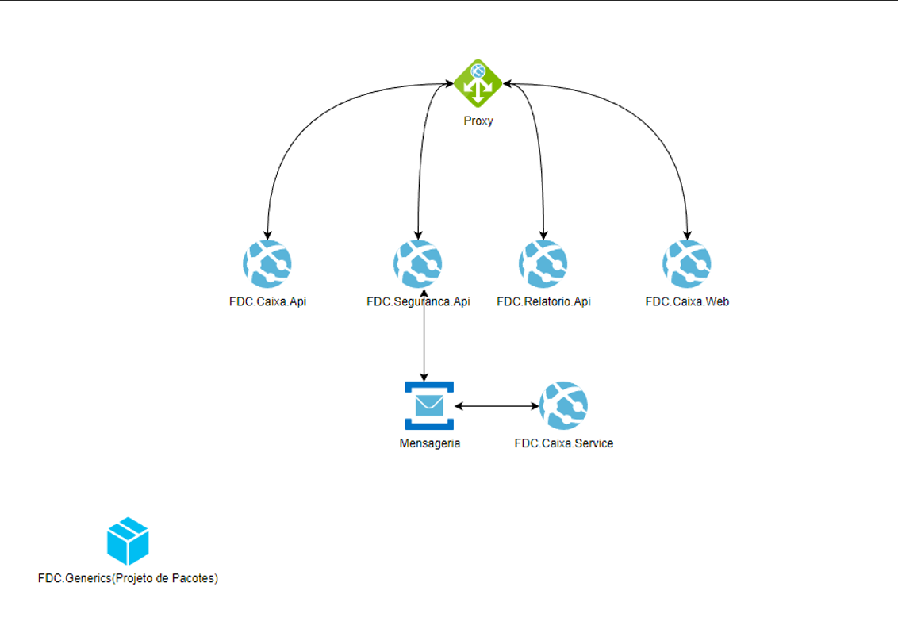
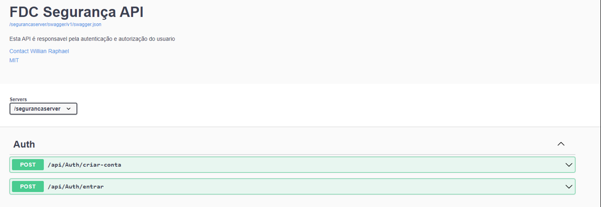
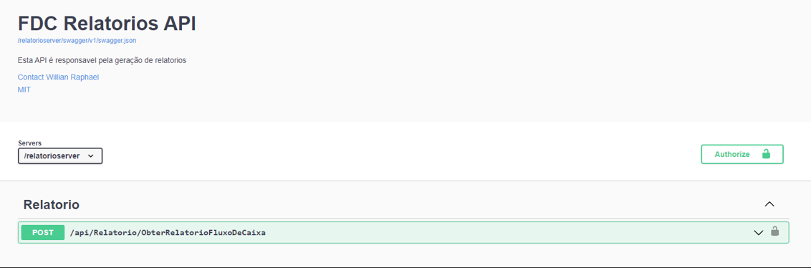
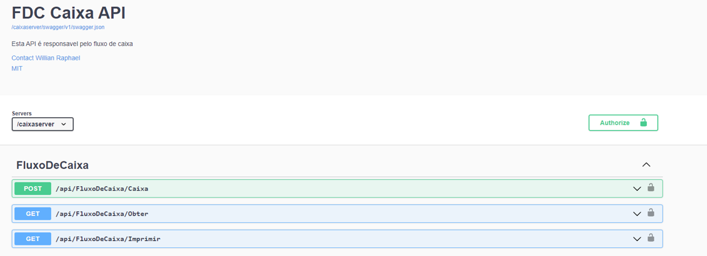
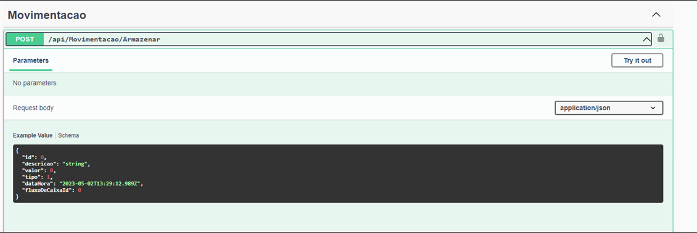

Por favor ler as observações pelo link https://github.com/willrapha/FDC/blob/main/docs/observacoes.pdf ou direto pela pasta docs na raiz do projeto.

# Aplicação

Para executar a aplicação via Docker, execute o comando docker-compose up -d na raiz do projeto.

# Urls

Autenticação
http://localhost/segurancaserver/swagger/index.html

Fluxo de Caixa (Abrir, fechar, Obter e Imprimir)
http://localhost/caixaserver/swagger/index.html

Relatórios
http://localhost/relatorioserver/swagger/index.html 

# Swagger Segurança

Criar-conta – método para se cadastrar na aplicação.
Entrar – método para realizar login na aplicação.

# Swagger Relatório

ObterRelatorioFluxoDeCaixa – Método para gerar relatório do fluxo de caixa, necessário estar autenticado.

# Swagger Aplicação

FluxoDeCaixa/Caixa – Método que criar um novo fluxo de caixa e tbm o fecha o caixa, necessário estar autenticado.

Parâmetros:
{
  "id": 0, (Zero para criação e maior que zero para edição)
  "situacao": 1 (Aberto = 1 e Fechado = 2)
}

FluxoDeCaixa/Obter – Método para obter o fluxo de caixa junto de suas movimentações. Recebe o id de um fluxo existente, necessário estar autenticado.

FluxoDeCaixa/Imprimir – Método responsável para imprimir o fluxo de caixa. Recebe o id de um fluxo existente, necessário estar autenticado.

Método responsável para cadastrar ou editar as movimentações, necessário estar autenticado.

{
  "id": 0, (Zero para criação e maior que zero para edição)
  "descricao": "string", (Descrição sobre o lançamento)
  "valor": 0, (Valor do lançamento)
  "tipo": 1, (Debito = 1 e Credito = 2)
  "fluxoDeCaixaId": 0 (Id do fluxo de caixa que será lançada a movimentação)
}

